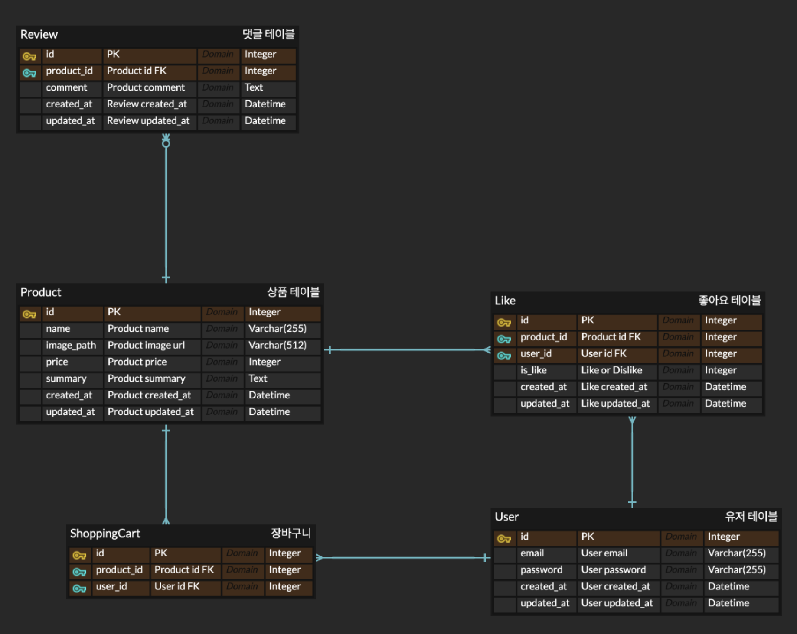

# Pangtok Backend

## Tech Stack

```
Python
FastAPI
SQLAlchemy
Alembic
Pytest
Pydantic
```

## Installation / Execution

```
docker build -t pangtok .

# Run application
docker run --rm -p <port>:8000 --name <name> -e DB_NAME=<db_name> -e DB_USER=<db_user> -e DB_PASSWORD=<db_password> -e DB_PORT=<db_port> -e DB_HOST=<db_host> pangtok

# Test
docker run --rm -p <port>:8000 --name <name> -e DB_NAME=<db_name> -e DB_USER=<db_user> -e DB_PASSWORD=<db_password> -e DB_PORT=<db_port> -e DB_HOST=<db_host> pangtok python -m pytest

# Show test coverage
coverage run -m pytest -s
coverage report -m
```

## Project Structure

```
├── Dockerfile       # Dockerfile
├── README.md
├── alembic.ini      # Alembic configuration file
├── app.py           # Create fastapi app
├── const.py
├── db.py            # Database configuration file
├── depends.py       # Fastapi depends file
├── dto              # Request/Response dto files
│   ├── __init__.py
│   ├── cart.py
│   ├── like.py
│   └── product.py
├── exception.py     # Exception file
├── main.py          # Entrypoint
├── migrations       # Alembic migration files
│   ├── README
│   ├── env.py
│   ├── script.py.mako
│   └── versions
├── my.cnf           # Docker mysql configuration for utf
├── orm              # ORM mapper files
│   ├── __init__.py
│   ├── base.py
│   ├── cart.py
│   ├── like.py
│   ├── product.py
│   ├── review.py
│   └── user.py
├── presentation     # API Controller layer
│   ├── __init__.py
│   ├── cart.py
│   ├── like.py
│   ├── ping.py
│   └── product.py
├── pytest.ini       # Pytest configuration file
├── repository       # Repository layer
│   ├── base.py
│   ├── cart.py
│   ├── like.py
│   └── product.py
├── requirements.txt # Dependency files
├── service          # Service layer
│   ├── __init__.py
│   ├── cart.py
│   ├── like.py
│   └── product.py
├── settings.py      # Setting file
└── tests            # Test files
    ├── conftest.py  # Test configuration
    ├── e2e          # E2E test files
    │   ├── test_cart.py
    │   ├── test_like.py
    │   ├── test_ping.py
    │   └── test_product.py
    └── helper.py    # Test const variable
```


## Test Coverage

```
❯ coverage report -m
Name                           Stmts   Miss  Cover   Missing
------------------------------------------------------------
app.py                            18      0   100%
const.py                           4      0   100%
db.py                             14      0   100%
depends.py                        16      0   100%
dto/__init__.py                    0      0   100%
dto/cart.py                       19      0   100%
dto/like.py                        4      0   100%
dto/product.py                    18      0   100%
exception.py                      14      0   100%
orm/__init__.py                    5      0   100%
orm/base.py                        8      0   100%
orm/cart.py                       10      0   100%
orm/like.py                       10      0   100%
orm/product.py                    12      0   100%
orm/review.py                      8      0   100%
orm/user.py                        9      0   100%
presentation/__init__.py           0      0   100%
presentation/cart.py              23      0   100%
presentation/like.py              15      0   100%
presentation/ping.py               5      0   100%
presentation/product.py           19      0   100%
repository/base.py                16      0   100%
repository/cart.py                 9      0   100%
repository/like.py                 8      0   100%
repository/product.py              6      0   100%
service/__init__.py                0      0   100%
service/cart.py                   31      0   100%
service/like.py                   21      0   100%
service/product.py                24      0   100%
settings.py                       16      0   100%
tests/conftest.py                 49      0   100%
tests/e2e/test_cart.py            45      0   100%
tests/e2e/test_like.py            23      0   100%
tests/e2e/test_ping.py             8      0   100%
tests/e2e/test_product.py         36      0   100%
tests/helper.py                   12      0   100%
tests/unit/test_exception.py       9      0   100%
tests/unit/test_settings.py        6      0   100%
------------------------------------------------------------
TOTAL                            550      0   100%
```

## ERD


